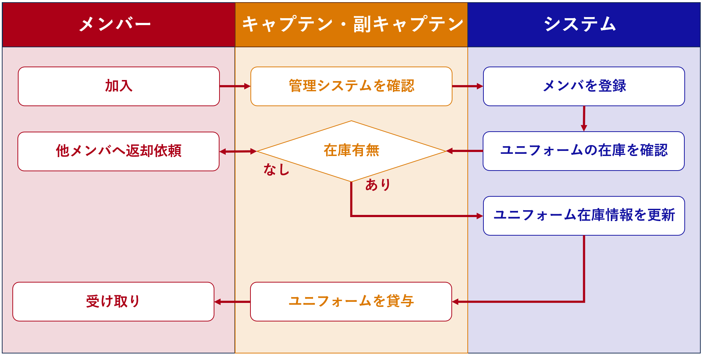
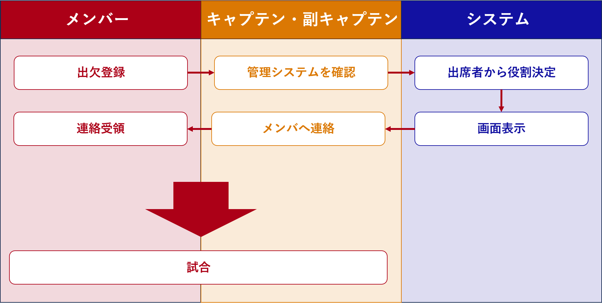

# 設計

## 1.業務フロー

**ユニフォーム管理**

**役割決定**

## 2.画面遷移図

[Figma](https://www.figma.com/design/bufWIAHGQgnNmAO8UsYdo5/%E7%84%A1%E9%A1%8C?node-id=147-2648)

## 3.ワイヤーフレーム

作成中：[Figma](https://www.figma.com/design/bufWIAHGQgnNmAO8UsYdo5/%E7%84%A1%E9%A1%8C?node-id=0-1&node-type=canvas&t=Pp4xRB59oTes7kuN-0)

## 4.テーブル定義書（もしくは ER 図）

## 5.システム構成図

作成中
